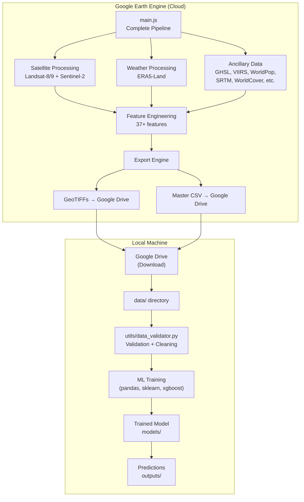
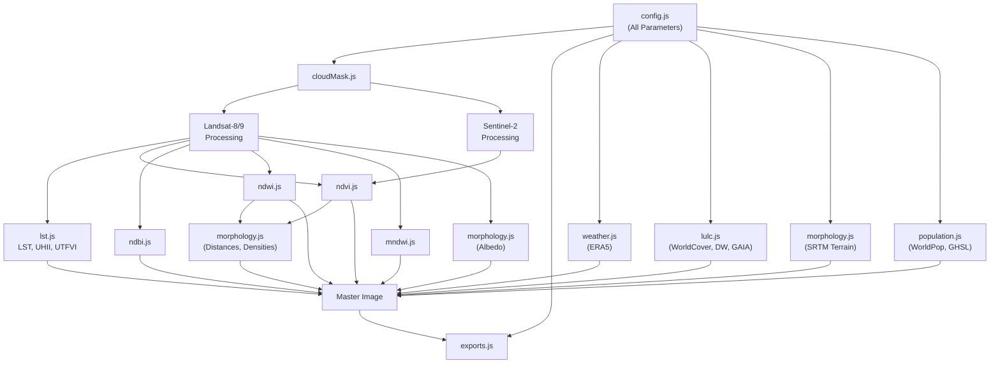

# System Architecture

Technical architecture of the Urban Heat AI system.

---

## High-Level Architecture



---

## Module Dependency Graph



---

## Design Principles

### 1. Single Runnable Script
GEE Code Editor does not support JavaScript module imports from local files. Therefore, `main.js` is a self-contained script that includes all logic from the module files. The module files (`config.js`, `cloudMask.js`, etc.) exist as **organized reference documentation** — each file shows the isolated logic for one concern.

### 2. Modular Sections
`main.js` is organized into 17 clearly labeled sections with visual separators. This allows:
- Easy navigation (search for "SECTION 7" to find ERA5 weather)
- Independent modification of any section without affecting others
- Future refactoring into GEE repository modules using `require()`

### 3. Configuration-Driven
All user-editable parameters are in Section 1. To analyze a different city, the user only changes ~5 variables. No other code modifications needed.

### 4. Resolution Alignment
Different datasets have different native resolutions (10m to 11km). The pipeline:
- Processes each dataset at its native resolution
- Resamples to the export resolution (30m) only at the final stacking step
- Uses bilinear interpolation for continuous variables
- Uses nearest-neighbor for categorical variables (LULC classes)

### 5. Defensive Data Handling
- Reflectance clamped to [0, 1]
- LST clamped to [-10, 70]°C
- Humidity clamped to [0, 100]%
- Nighttime lights floored at 0 (removes negative artifacts)
- try/catch for optional datasets (GHSL)
- QualityScore tracks observation count per pixel

### 6. ML-Ready Output
The CSV is designed for direct ingestion by ML frameworks:
- No geometry columns (retainGeometry: false)
- Consistent column naming (snake_case + PascalCase)
- No missing values (masked pixels excluded during sampling)
- Explicit target variable (LST)
- Metadata columns (PixelID, Timestamp) for tracking

---

## Extension Points

### Adding New Features
1. Compute the new feature as an `ee.Image` in the appropriate section
2. Add it to the `masterImage` stack in Section 13
3. Add the band name to the `csvColumns` array in Section 16
4. Add an `exportTIFF()` call in Section 15
5. Add a `Map.addLayer()` call in Section 14

### Adding ML (Future)
The CSV output is compatible with:
```python
import pandas as pd
df = pd.read_csv('Delhi_UHI_MasterDataset.csv')
X = df.drop(columns=['PixelID','Latitude','Longitude','Timestamp','LST'])
y = df['LST']
```

### Migrating to GEE Repository Modules
When you have a GEE repository, convert module files to:
```javascript
// In your GEE repo: users/yourname/UrbanHeatAI:modules/cloudMask
exports.maskLandsatClouds = function(image) { ... };
exports.scaleLandsat = function(image) { ... };

// In main.js:
var cloudMask = require('users/yourname/UrbanHeatAI:modules/cloudMask');
```

---

## Performance Considerations

| Operation | Cost | Optimization |
|-----------|------|-------------|
| ERA5 hourly filtering | High (many images) | Consider using MONTHLY_AGGR instead |
| fastDistanceTransform | High (global search) | Limited to 512 pixel radius |
| reduceNeighborhood | Moderate | Fixed kernel radius of 5 pixels |
| reproject + resample | Moderate | Applied only once at final stacking |
| CSV sampling | High for large areas | Limited by MAX_CSV_POINTS |
| GeoTIFF export | Low per file | 33 parallel tasks |
