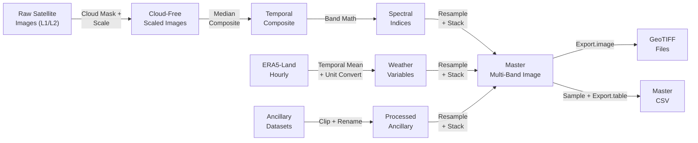

# Dataset Metadata

Metadata schema and technical details for all exported products.

---

## Master CSV Dataset

| Property | Value |
|----------|-------|
| **File Name** | `{City}_UHI_MasterDataset.csv` |
| **Format** | Comma-Separated Values (CSV) |
| **Encoding** | UTF-8 |
| **CRS** | EPSG:4326 (WGS84 Geographic) |
| **Spatial Resolution** | ~100m (sample spacing) |
| **Temporal Coverage** | User-defined (default: 2024-03-01 to 2024-06-30) |
| **Rows** | Up to 100,000 (configurable via MAX_CSV_POINTS) |
| **Columns** | 37+ (see Feature_Definitions.md) |
| **Missing Values** | None (masked pixels excluded during sampling) |
| **Target Variable** | LST (Land Surface Temperature in °C) |

### Column Order
```
PixelID, Latitude, Longitude, Timestamp,
LST, NDVI, NDBI, NDWI, MNDWI, Albedo,
LULC_ESA, LULC_DW, Impervious_Frac, Tree_Cover_Pct,
AirTemp, Humidity, WindSpeed, WindDirection, SolarRadiation, Pressure, Rainfall,
Elevation, Slope, Aspect,
Building_Density, Building_Height, Building_Volume, Nighttime_Lights, Population_Density,
Dist_Water, Dist_Green,
Green_Space_Density, Surface_Roughness, Anthropogenic_Heat, Road_Density_Proxy,
UHI_Intensity, UTFVI,
QualityScore
```

---

## GeoTIFF Exports

All GeoTIFF files share these properties:

| Property | Value |
|----------|-------|
| **Format** | GeoTIFF |
| **CRS** | EPSG:4326 (WGS84) |
| **Pixel Size** | 30m (except Sentinel-2 composite: 10m) |
| **Data Type** | Float32 (continuous) or Uint8 (categorical) |
| **NoData Value** | NaN (masked pixels) |
| **Compression** | Default GEE export |

### Export File Inventory

| # | File Name Pattern | Bands | Resolution | Use |
|---|------------------|-------|------------|-----|
| 1 | `{City}_LST.tif` | 1 | 30m | Visualization, Analysis |
| 2 | `{City}_NDVI.tif` | 1 | 30m | Visualization |
| 3 | `{City}_NDBI.tif` | 1 | 30m | Visualization |
| 4 | `{City}_NDWI.tif` | 1 | 30m | Visualization |
| 5 | `{City}_MNDWI.tif` | 1 | 30m | Visualization |
| 6 | `{City}_Albedo.tif` | 1 | 30m | Visualization |
| 7 | `{City}_LULC_ESA.tif` | 1 | 30m | Visualization |
| 8 | `{City}_LULC_DW.tif` | 1 | 30m | Visualization |
| 9 | `{City}_Impervious.tif` | 1 | 30m | Visualization |
| 10 | `{City}_TreeCover.tif` | 1 | 30m | Visualization |
| 11–17 | `{City}_AirTemp.tif`, etc. | 1 each | 30m | Visualization |
| 18–20 | `{City}_Elevation.tif`, etc. | 1 each | 30m | Visualization |
| 21–24 | `{City}_Building_*.tif`, etc. | 1 each | 30m | Visualization |
| 25–30 | Derived features | 1 each | 30m | Visualization |
| 31–32 | `{City}_UHI_Intensity.tif`, `{City}_UTFVI.tif` | 1 each | 30m | Visualization |
| 33 | `{City}_QualityScore.tif` | 1 | 30m | Quality Assessment |
| 34 | `{City}_Landsat_Composite.tif` | 6 | 30m | Reference |
| 35 | `{City}_Sentinel2_Composite.tif` | 6 | 10m | Reference |

---

## Processing Lineage



---

## Spatial Reference Details

| Property | Value |
|----------|-------|
| CRS | EPSG:4326 |
| Datum | WGS84 |
| Units | Decimal Degrees |
| Pixel Size | ~0.00027° (≈30m at equator) |
| Origin | Upper-left corner of study area bounding box |

---

## Temporal Reference

| Property | Value |
|----------|-------|
| Compositing Method | Pixel-wise median over date range |
| Date Range | User-defined (default: 2024-03-01 to 2024-06-30) |
| Temporal Semantics | Single-epoch composite (no time series) |
| ERA5 Aggregation | Mean of all hourly values in date range |
| Rainfall Aggregation | Sum (total accumulated) |
