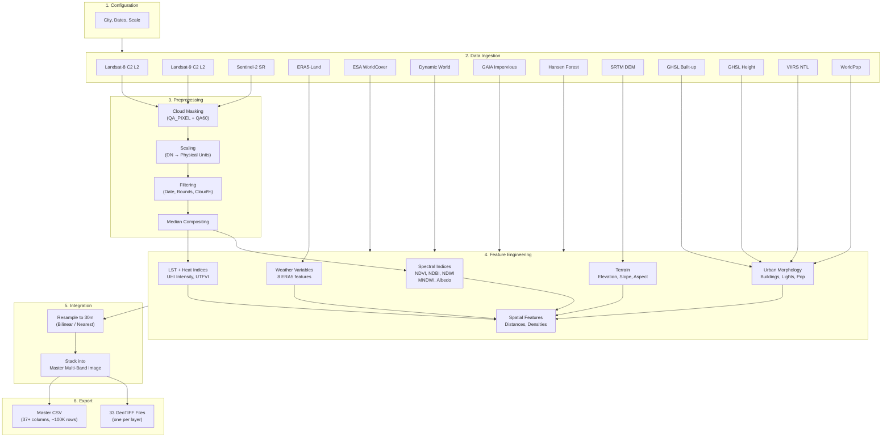

# Processing Workflow

Step-by-step description of the data pipeline from raw satellite data to AI-ready CSV.

---

## Pipeline Architecture

---

## Step-by-Step Process

### Step 1: Configuration
- User sets city center (lat/lon) or administrative boundary name
- User sets date range (recommended: March–June for Indian summer)
- All parameters are in Section 1 of `main.js`

### Step 2: Study Area Definition
- Create circular buffer or load FAO GAUL admin boundary
- All subsequent data is clipped to this region

### Step 3: Landsat-8/9 Processing
1. Load `LANDSAT/LC08/C02/T1_L2` and `LANDSAT/LC09/C02/T1_L2`
2. Filter by study area bounds, date range, and cloud cover < 20%
3. Merge both collections (identical band structure)
4. Apply scaling: SR_B* → reflectance [0,1]; ST_B10 → Kelvin
5. Apply cloud mask: QA_PIXEL bits 1–4 (dilated cloud, cirrus, shadow, cloud)
6. Also mask saturated pixels via QA_RADSAT
7. Compute pixel-wise median composite
8. Clip to study area
9. Count valid observations per pixel → QualityScore

### Step 4: Sentinel-2 Processing
1. Load `COPERNICUS/S2_SR_HARMONIZED`
2. Filter by bounds, dates, cloud percentage
3. Scale: divide by 10000 → reflectance [0,1]
4. Cloud mask: QA60 bits 10–11 (opaque cloud, cirrus)
5. Median composite and clip

### Step 5: Spectral Index Computation
| Index | Formula | Bands |
|-------|---------|-------|
| NDVI | (NIR−Red)/(NIR+Red) | SR_B5, SR_B4 |
| NDBI | (SWIR1−NIR)/(SWIR1+NIR) | SR_B6, SR_B5 |
| NDWI | (Green−NIR)/(Green+NIR) | SR_B3, SR_B5 |
| MNDWI | (Green−SWIR1)/(Green+SWIR1) | SR_B3, SR_B6 |
| Albedo | Liang (2001) weighted sum | SR_B2,4,5,6,7 |

### Step 6: LST and Heat Indices
1. Extract ST_B10 from Landsat composite → convert K to °C
2. UHI Intensity = LST_pixel − mean(LST where LULC ≠ built-up)
3. UTFVI = (LST − mean_LST) / mean_LST

### Step 7: Land Cover Loading
- ESA WorldCover: single global mosaic, clip to study area
- Dynamic World: mode of label band over date range
- GAIA: binary impervious (change_year_index > 0)
- Hansen: treecover2000 percentage

### Step 8: ERA5 Weather Extraction
- Load hourly ERA5-Land, filter to study area and dates
- Compute temporal mean for each variable
- Convert units (K→°C, Pa→hPa, J/m²→W/m², m→mm)
- Derive humidity via Magnus formula
- Derive wind speed and direction from U/V components

### Step 9: Terrain Computation
- Load SRTM 30m DEM
- Use `ee.Terrain.products()` for slope and aspect

### Step 10: Urban Morphology
- GHSL Built-up Surface (building density)
- GHSL Building Height
- Building Volume = density × height
- VIIRS nighttime lights (median monthly composite)
- WorldPop population density

### Step 11: Spatial Feature Derivation
- Distance to Water: `fastDistanceTransform` on NDWI > 0 mask
- Distance to Green: `fastDistanceTransform` on NDVI > 0.4 mask
- Green Space Density: focal mean of NDVI > 0.3 in 150m radius
- Surface Roughness: focal stdDev of elevation in 150m radius
- Anthropogenic Heat: nightlights_norm × population_norm
- Road Density Proxy: impervious − (LULC == built-up)

### Step 12: Resolution Alignment
- ERA5 (~11km), GHSL (10–100m), VIIRS (500m), WorldPop (100m)
- Continuous layers: bilinear resampling to 30m
- Categorical layers (LULC): nearest-neighbor to 30m

### Step 13: Export
- Stack all layers into master multi-band image
- Export 33 individual GeoTIFFs to Google Drive
- Sample master image → FeatureCollection → export as CSV
- CSV includes: coordinates, all features, quality score, timestamp

---

## Data Quality Measures

| Measure | Implementation |
|---------|---------------|
| Cloud removal | QA_PIXEL (L8/9) + QA60 (S2) bit-flag masking |
| Shadow removal | QA_PIXEL bit 3 (cloud shadow) |
| Saturation removal | QA_RADSAT band masking |
| Invalid pixel removal | Reflectance clamped to [0,1], LST clamped to [−10,70]°C |
| Temporal compositing | Pixel-wise median (robust to outliers) |
| CRS normalization | All exports in EPSG:4326 |
| Resolution alignment | Bilinear (continuous) / Nearest (categorical) resampling |
| Quality tracking | QualityScore = count of valid Landsat observations |
